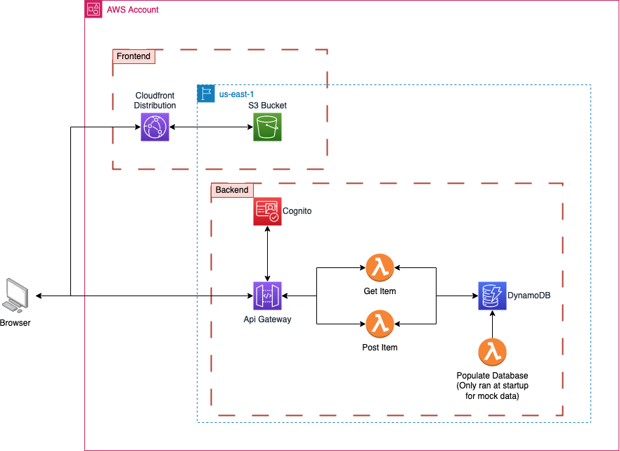

# Welcome to your CDK TypeScript project

This is a blank project for CDK development with TypeScript.

The `cdk.json` file tells the CDK Toolkit how to execute your app.

## Useful commands

* `npm run build`   compile typescript to js
* `npm run watch`   watch for changes and compile
* `npm run test`    perform the jest unit tests
* `cdk deploy`      deploy this stack to your default AWS account/region
* `cdk diff`        compare deployed stack with current state
* `cdk synth`       emits the synthesized CloudFormation template

## Quick tour of this repository
- `./lib/app.ts` - This is a TypeScript file where the CDK Application is defined.
- `./lib/database.ts` - This is a TypeScript file that contains the DynamoDB Database
- `./lib/api.ts` - This is a TypeScript file that contains the backend API services such as API Gateway, Cognito, and Lambdas
- `./lib/frontend.ts` - This is a TypeScript file that contains the frontend hosting of an CloudFront Distribution backed by an S3 Bucket
- `./lambdas` - This is a directory containing all lambda function source code used for the backend
- `./frontend` - This is a directory containing frontend source code deployed into the S3 Bucket for user consumption

## Architecture
